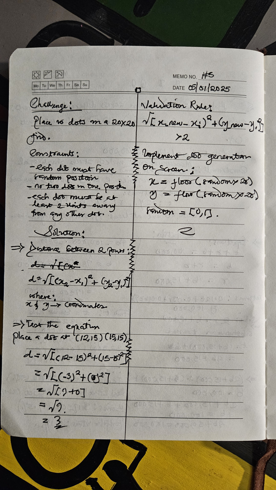

## day 5

You need to place 10 dots on a 20x20 grid, where:

- Each dot must have a random position
- No two dots can occupy the same position
- Each dot must be at least 2 units away from any other dot (to prevent overlapping)

Given:

- The grid coordinates go from (0,0) to (19,19)
- Each dot has a radius of 1 unit
- You need to determine if a new random position is valid before placing a dot

Your challenge:

1. Write a formula to calculate the distance between two dots at positions (x₁,y₁) and (x₂,y₂)
2. What's the mathematical condition that must be satisfied for a new dot position to be valid?
3. If you've already placed 7 dots and generate coordinates (12,15) for your 8th dot, write out the mathematical checks you'd need to perform to verify if this position is valid.

## solution
