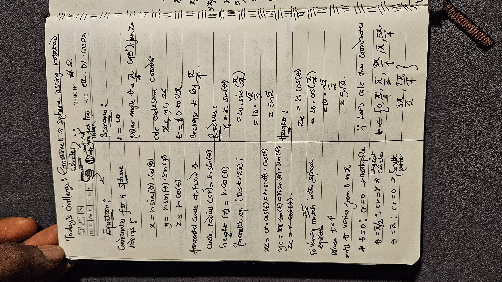
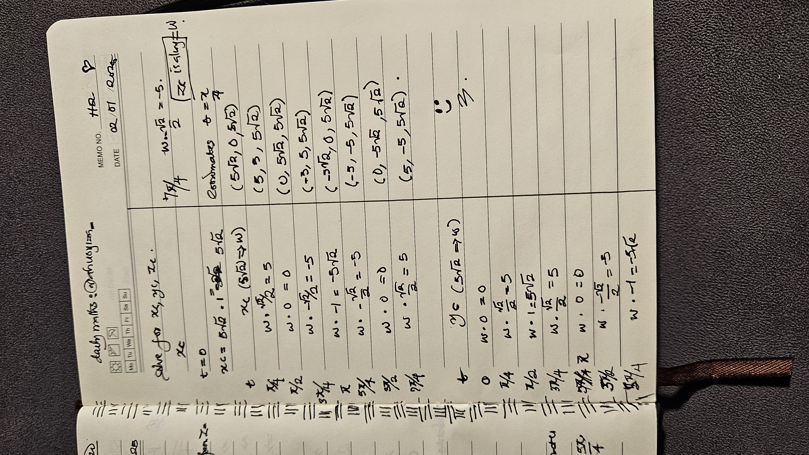

# Parametric Sphere Construction Using Concentric Circles in 3D Space

**The  task:**

Create a set of concentric circles in 3D space, such that the union of these circles forms a sphere of radius \(r\). The goal is to determine the parametric equations and transformations required to:

1. Generate circles centered at the origin \((0, 0, 0)\).
2. Gradually vary the orientation of each circle so that together they represent the surface of a sphere.

**Constraints and Details:**

- The sphere is defined parametrically in spherical coordinates:

  $$x = r \cdot \sin(\theta) \cdot \cos(\phi)$$

  $$y = r \cdot \sin(\theta) \cdot \sin(\phi)$$

  $$z = r \cdot \cos(\theta)$$

  where:

  $$r \text{ is the radius of the sphere.}$$

  $$\theta \, (0 \leq \theta \leq \pi) \, \text{is the polar angle (latitude).}$$

  $$\phi \, (0 \leq \phi < 2\pi) \, \text{is the azimuthal angle (longitude).}$$

- Each circle should:
  1. Be generated by incrementing \(\theta\) (polar angle).
  2. Be rotated around the Z-axis based on \(\phi\) (azimuthal angle).
  3. Have its radius determined by \(r \cdot \sin(\theta)\) (adjusting for latitude).

- For a fixed $$(\theta)$$:
  - Generate points on the circle parametrically as:

    $$x_c = r_c \cdot \cos(t)$$

    $$y_c = r_c \cdot \sin(t)$$

    $$z_c = z_{\text{fixed}}$$

    where:

    $$t \, \text{is a parameter:} \, 0 \leq t < 2\pi.$$

    $$r_c \, \text{is the adjusted circle radius.}$$

    $$z_{\text{fixed}} = r \cdot \cos(\theta).$$

**Goal:**

adapt this in code 👀.

## Solution

 

