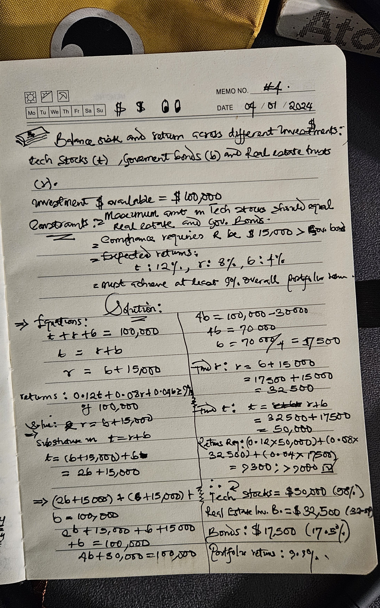

## Dat 4 task
Consider these investments options: Tech Stocks (T), Real Estate Investment Trusts (R), and Government Bonds (B). Here are your constraints:

1. You have $100,000 to invest in total
2. Based on your risk assessment, the maximum amount in Tech Stocks should equal the combined amount in REITs and Bonds
3. Due to compliance requirements, your REIT investment must be $15,000 more than your Bond investment
4. Your expected annual returns are:

Tech Stocks: 12%
REITs: 8%
Bonds: 4%

5. You need to achieve at least a 9% overall portfolio return

## Solution

