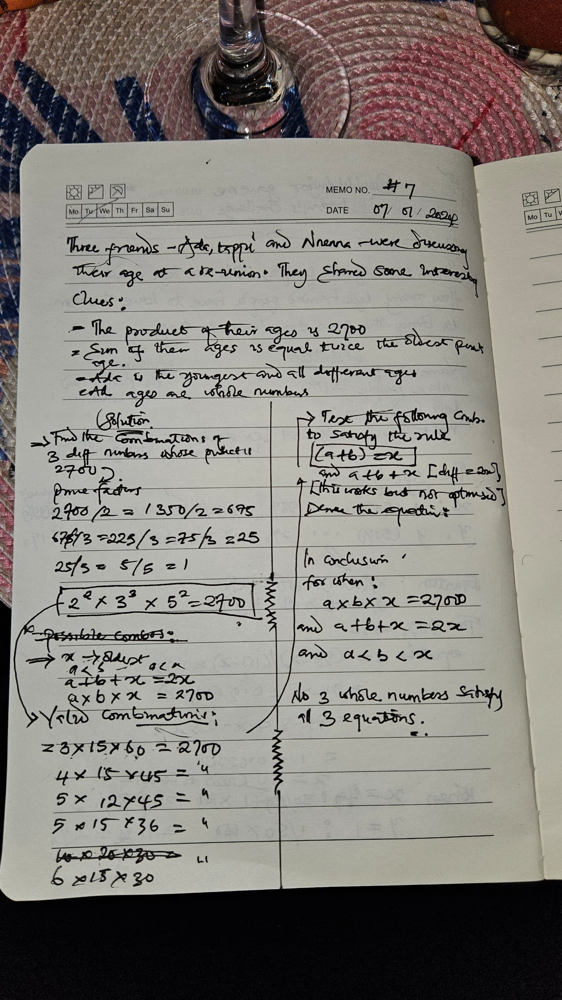

## Day 7 challenge

Three friends - Ada, Tappi, and Nnenna - were discussing their ages at a reunion. They shared some interesting clues:

1. The product of their ages is 2,700
2. The sum of their ages is equal to twice the oldest person's age
3. Ada is the youngest, and they're all different ages
4. All ages are whole numbers

Figure out how old each person is.

## Solution

