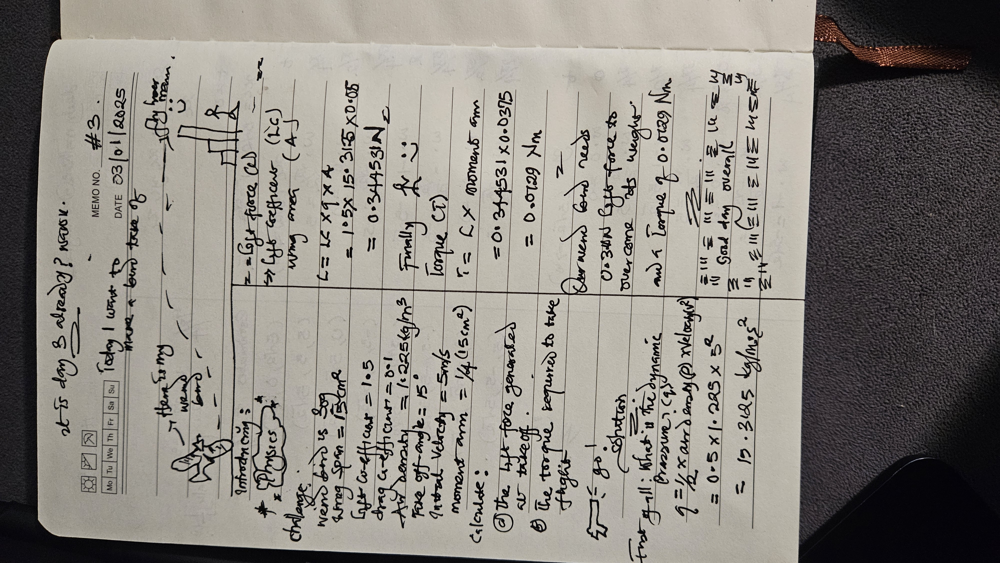

# Day 4: bird takeoff

## Task
Our tiny weird bird weighing 30 grams is preparing to take flight. Its wings span 15 centimeters with a total wing area of 15 square centimeters. Given that:

The lift coefficient of its wings is 1.5
The drag coefficient is 0.1
Air density is 1.225 kg/m³
The bird takes off at an angle of 15 degrees
Initial velocity is 5 m/s
Moment arm (distance from rotation point to center of pressure) is 1/4 of wing span

Calculate:

The lift force generated at takeoff
The torque required to initiate flight

## Solution
