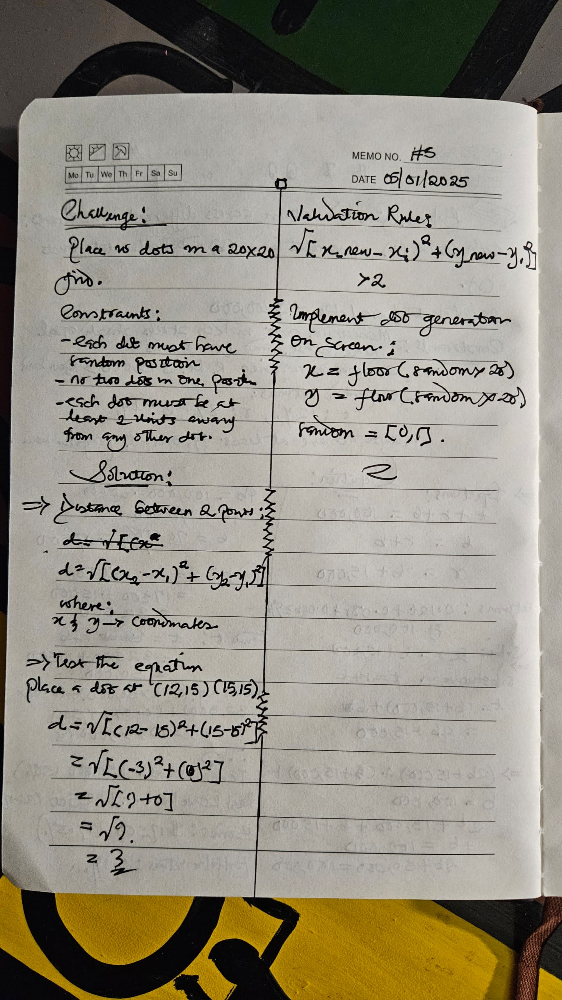

## Days callenge: provided by Olaitan @publikphigor

In a room of 100 people, 99% are left-handed. How many left-handed people have to leave the room to bring that percentage down to 98%?

## Solution
